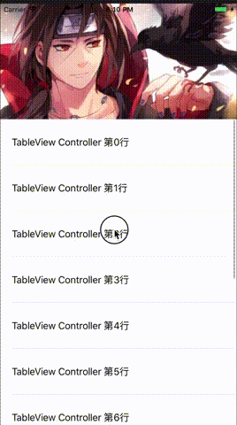

# YSMContainerView

[](https://travis-ci.org/yisimeng/YSMContainerView)
[](https://cocoapods.org/pods/YSMContainerView)
[](https://cocoapods.org/pods/YSMContainerView)
[](https://cocoapods.org/pods/YSMContainerView)



仿微博个人页，之前用Swift写了一个，但是只是效果实现了，但是扩展性不太好，所以从新优化了一下，重新写了一个。

[详细介绍及实现思路]()

## Installation

YSMContainerView is available through [CocoaPods](https://cocoapods.org). To install
it, simply add the following line to your Podfile:

```ruby
pod 'YSMContainerView'
```
## TODO

* TODO: 定位移除控制器
* TODO: 添加tab title，点击切换child vc

## Author

yisimeng, 465386131@qq.com

## License

YSMContainerView is available under the MIT license. See the LICENSE file for more info.
